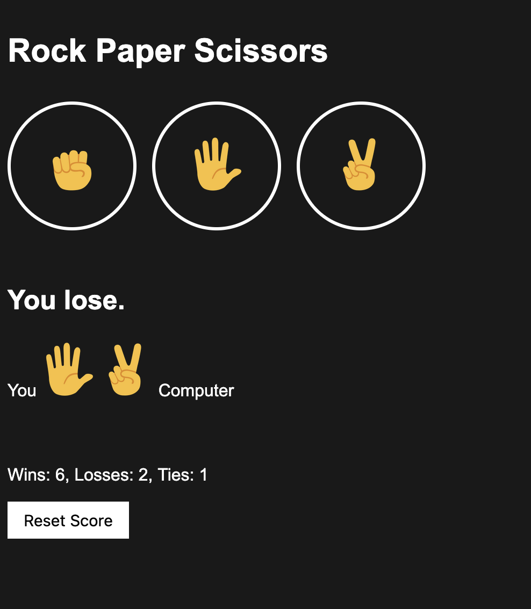

# 🪨📄✂️ Rock Paper Scissors  
*A simple browser-based Rock–Paper–Scissors game built with HTML, CSS, and JavaScript.*  

---

## 🎮 Overview
This is a web-based **Rock Paper Scissors** game where the player competes against the computer. The app runs directly in the browser and uses JavaScript to generate the computer’s move and determine the winner. The score is stored using `localStorage`, so it persists even if you refresh the page.

---

## 🚀 Features
- Three selectable moves: **Rock**, **Paper**, and **Scissors**
- Random computer move generation
- Round result display
- Scoreboard saved in browser storage
- Reset score button
- Simple and clean UI

---

## 📂 Project Structure
```
/
├── index.html # Main game UI
├── css/
│ └── styles.css # Styling
├── scripts/
│ └── scripts.js # Game logic
└── img/ # Rock, paper, scissors emojis
```

---

## 🧠 How It Works
- The user clicks a move button.
- The JavaScript function `playGame()` compares:
  - The player's move  
  - The computer's randomly generated move
- The result elements update:
  - Result message  
  - Moves display  
  - Scoreboard (wins, losses, ties)

The score uses `localStorage` to persist after refresh.

---

## ▶️ How to Run
Just open **index.html** in any modern browser:

### Option 1 — Direct:
Double-click `index.html`

### Option 2 — Local server (optional):
Use VS Code Live Server: 
- Right-click → "Open with Live Server"

No installation or dependencies required.

---

## 📌 Future Improvements
- Add animations or sound effects  
- Add keyboard shortcuts  
- Add dark/light theme toggle  
- Add match history  
- Add difficulty levels (random, pattern-based AI)

---

## 📜 License
This project is free for personal or educational use.  

